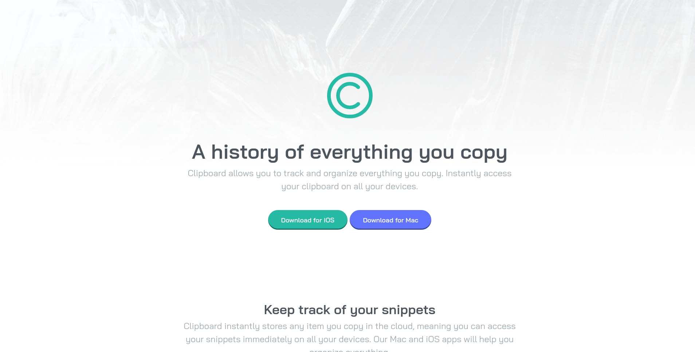

# Frontend Mentor - Clipboard landing page solution

This is a solution to the [Clipboard landing page challenge on Frontend Mentor](https://www.frontendmentor.io/challenges/clipboard-landing-page-5cc9bccd6c4c91111378ecb9).

## Table of contents

- [Overview](#overview)
  - [The challenge](#the-challenge)
  - [Screenshot](#screenshot)
  - [Links](#links)
- [My process](#my-process)
  - [Built with](#built-with)
- [Author](#author)
- [Acknowledgments](#acknowledgments)

## Overview

### The challenge

Users should be able to:

- View the optimal layout for the site depending on their device's screen size
- See hover states for all interactive elements on the page

### Screenshot

### Links

- Solution URL: https://www.frontendmentor.io/solutions/clipboard-landing-page-BkkT9IkN5
- Live Site URL: https://codykelly.dev/clipboard-landing-page/

## My process

### Built with

- Semantic HTML5 markup
- CSS custom properties
- Flexbox
- CSS Grid
- SCSS

## Author

- Website - https://codykelly.dev
- Frontend Mentor - [@CodyKelly](https://www.frontendmentor.io/profile/CodyKelly)

## Acknowledgments

The Frontend Mentor Slack community! They helped me so much with coding practices, resources, and troubleshooting. Thanks to everyone!
